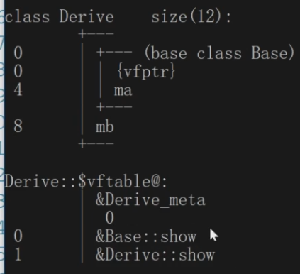
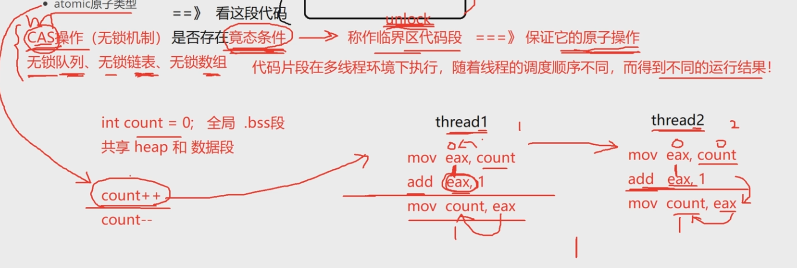

# C++基础笔记

\#if 0是一个注释代码块的技巧，它将注释掉的代码块放在条件编译指令中，并将#if 0替换为#if 1可以快速启用该代码块。

## 多态与继承

基类的private只有基类能看见 不仅外部看不见派生类也无法访问

public继承 基类的public 和 protected 在派生类中依然是public和protected

protected继承 基类的public 和 protected 在派生类中都是protected

private继承 基类的public 和 protected 在派生类中都是private

### 继承的好处

1.可以做代码的复用

2.可以在基类中给派生类提供统一接口，让派生类重写，然后就可以实现多态

### 总结

外部只能访问public成员，protected 和private无法访问

在继承结构中，派生类虽然继承了基类的private成员但是无法直接访问

protected和private区别？在基类中定义的成员，想被派生类访问但是不想被外部访问，将该成员定义为protected；若不打算让外部和派生类访问则定义为private。

### 派生类不能继承基类的构造析构函数，派生类怎么初始化从基类继承来的成员变量？

调用基类相应的构造函数，派生类的构造析构函数负责派生类的部分，从基类继承的成员由基类的构造析构负责

### 重载

作用域相同，函数名相同，参数不同，：派生类和基类的同名函数不属于重载因为他们的作用域不同

### 隐藏

作用域的隐藏派生类的函数名与基类相同，调用时默认使用派生类的函数，若想使用基类的函数加上作用域 Base::show（）

基类对象 接收一个派生类对象的赋值 类型从下到上 Y 小的指向大的 

派生类对象 接收一个基类对象的赋值 类型从上到下 N  大的指向小的

基类指针指向派生类对象 只能访问派生类对象中继承基类的部分 


## 虚函数、静态绑定和动态绑定

### 静态绑定：编译时就确定了

### 虚函数

​	如果类中定义了虚函数，则编译阶段会给这个类的类型产生一个唯一的vftable虚函数表，虚函数表中存储的主要内容是RTTI指针和虚函数的地址。（RTTI）运行时类型信息。当程序运行时，每一张虚函数表都会加载到内存的.rodata区


 	一个类里面如果定义了虚函数，那么这个类定义的对象在其运行时，内存中开始的部分会多存储一个vfptr虚函数指针，指向该类型的虚函数表vftable。这个类定义的所有对象都指向同一张虚函数表。


​	一个类里面虚函数的个数不影响对象的大小，因为虚函数地址存在虚函数表中，对象中只存了虚函数表的地址，只会改变虚函数表的大小。

​	注意：在类的构造函数一开始就会把虚函数表的地址写入到虚函数指针中

#### 覆盖	

​	如果派生类中的方法和基类继承的某个方法，返回值、函数名、参数列表都相同，并且基类的方法加上了virtual虚函数，那么派生类的这个方法也是虚函数，会重写虚函数表中虚函数 重写《》覆盖。


### 动态绑定

如果发现对象调用的函数是普通函数则进行静态绑定，如果发现该函数时虚函数则进行动态绑定

```assembly
mov eax, dword ptr[pb]      //将对象的前4个字节即虚函数表地址移入eax寄存器
mov ecx, dword ptr[eax]     //eax寄存器中即虚函数表的前四个字节(虚函数地址)移入ecx寄存器
call ecx                    //运行时才知道ecx寄存器中存的是哪个函数的地址    
```



​	用类型对应的对象调用虚函数不会发生动态绑定，依旧是静态绑定

```c++
Base b;
Derive d;
b.show() //静态绑定
d.show() //静态绑定

//以下都是动态绑定->指针（引用）调用虚函数
Base *pb1 = &b;
pb1->show();
Base *pb2 = &d;
pb2->show();
```

**哪些函数不能实现成虚函数？**

虚函数依赖：

1.虚函数能产生地址，存储在vftable中

2.对象必须存在（vfptr->vftable->虚函数地址）

构造函数1.virtual+构造函数 NO! 2.构造函数中调用的任何函数都是静态绑定

static 静态成员方法 NO！ 不依赖对象

**虚析构函数**

```c++
class Base{
public:
Base (int data) :ma (data) { cout <<Base()<<endl; }
//虚析构函数
virtual ~Base() { cout<<"~Base ( ) " <<endl;
virtual void show () {cout << "call Base: : show ( ) " <<endl; }
protected:
int ma;
}; // &Base: :~Base

class Derive : public Base{
public:
Derive (int data)
: Base (data) , mb (data) , ptr (new int (data) )
{
cout<< "Derive ( ) " <<endl;
}
~Derive ()
{
	delete ptr;
}
private :
	int mb ;
	int *ptr;
};
int main(){
    Base* pb = new Derive(10);
	delete pb; //派生类的析构函数没被调用！
}
```

基类的虚构函数是虚函数则派生类的析构函数自动是虚函数

#### **什么时候基类的析构函数必须实现成虚函数？**

​	基类的指针指向堆上new出来的派生类对象的时候， delete pb（基类的指针），它调用析构函数的时候，必须动态绑定，否则无法调用派生类的析构函数

## 抽象类

​	拥有纯虚函数的类叫做抽象类，抽象类不能再实例化对象，但是可以定义指针和引用，目的给派生类提供统一的接口

## 虚基类

​	继承时被使用virtual修饰的基类称为虚基类，虚继承会产生虚基类指针vbptr，在对象空间的起始地址，指向虚基类表vbtable，主要存虚基类属性距离对象起始地址的偏移量，并且会移动派生类对象中基类部分从起始地址开头移到派生类部分的后面。

​	基类指针指向派生类对象永远指向的时派生类中基类部分数据的起始地址

## 多继承

​	菱形继承会导致重复调用构造函数，存在多份间接基类的属性，造成资源浪费，使用虚继承解决问题


## C++语言级别的四种类型转换方式

const_cast :去掉常量属性的一个类型转换,与强制转换比安全 < >中必须是指针或引用类型

**static_cast** :提供编译器认为合适的类型转换，没有任何联系的类型转换会被否定

reinterpret_cast :类似于C风格的强制转换

dynamic_cast :主要用在继承中，支持RTTI类型识别的上下转换

## const

​	const修饰的变量不能再作为左值，初始化后值不能被修改

### **C和C++const的区别**

​	C语言中const修饰的值是常变量，不是常量，只是不能作为左值被修改

```c
void main ()
{
	const int a = 20;
	int array[a] = {}; //错误
    int * p = (int*)&a;
    *p = 30;
    //30 30 30,可以通过指针修改值
    printf("%d %d %d",a,*p,*(&a) ); 
}
```

​	C++ const用立即数初始化叫常量，必须初始化，所有出现常量名字的地方都在编译阶段被常量的初始化值替换；若用另一个const初始化则叫常变量与C中相同

```c++
int main ()
{
	const int a = 20;
    int * p = (int*)&a;
    *p = 30; //把a内存对应的值改为30
     //20 30 20
    printf("%d %d %d",a,*p,*(&a) ); //-> printf("%d %d %d",20,*p,20);
}

int main ()
{
    int b = 20;
	const int a = b; //这样就退化成了常变量和C中一样
	int array[a] = {}; //错误
    int * p = (int*)&a;
    *p = 30; 
     //30 30 30
    printf("%d %d %d",a,*p,*(&a) ); 
}
```

**C++和一级指针的结合**

​	C++中const修饰离他最近的类型，看时把他修饰的类型去掉

​	const int *p -> const 修饰的int， const *p 即 *p不能再被赋值

 	int const *p与上面一样因为 *不能单独作为一个类型

​	int *const p-> const 修饰的  int * ，cont p即p指针指向不能被改变

```c++
const int *p = &a;  
*p = 20; //不行
p = &b; //可以
```

```c++
int *const p =&a; //指针是常量，不能修改指向，但是可以修改指向的值
*p = 20;//YES
p = &b;//NO
```

**int*const 类型还是int * ，即const 右边没*则const不参与类型**

**C++和二级指针的结合**

​	const int ** q  ,const 修饰的int， const** q 即 **q不能再被赋值

​	int *const *q  ,const 修饰的int *， const * q 即 *q不能再被赋值

​	int ** const q  ,const 修饰的int **， const  q 即 q指针指向不能被改变

**const和多级指针结合的时候，类型转换一边有const一边没有是不行的**

int **  <- const int **  //NO!

const int ** <- int **  //NO!

int ** <- int * const* 相当于 int* <- const int *  //NO

int * const * <- int **  相当于 const int * <-  int *  //YES

## C++引用 

​		定义一个引用变量和定义一个指针变量在汇编上是一模一样的；引用和指针在改变指向内存的值时其汇编指令也时一模一样的

### 右值引用		

​		右值引用专门引用右值类型，指令上可以自动产生临时量然后之间引用临时量，一个右值引用变量本身是一个左值

```c++
int &&c = 20;
c = 30; //可以
 int &d = 20 //不可以
const int &d = 20; //可以
```


const 指针引用类型转换的判断->把引用换成指针

```c++
int a = 10;
const int *p = &a;
int *&q = p; //-> int ** q = &p;

```

## new和delete

**new和malloc，delete和free的区别是什么**

1.  new、delete 是运算符，malloc、free是C库函数
2.  new不仅做内存开辟，还可以做内存初始化操作
3.  malloc开辟内存失败，由返回值和nullptr比较；new则会抛出bad_alloc类型的异常

```c++
int *q = new int[20]()； //20个int大小的空间，初始化为0
delete q[ ]；
```

**new有多少种**

​	4种

```c++
int *p1 = new int (20);
int *p2 = new (nothrow) int;
const int *p3 = new const int(40);
//定位new
int data = 0;
int *p4 = new (&data) int (50);//在data的地址上开辟空间初始化
```


new Test[5] 4字节记录对象个数，返回第一个对象的起始地址；

delete[]和delete区别：用delete[]会从第一个对象开始调用每个的析构然后在0x100调用free，delete只会调用一个析构然后free0x104

## 面向对象OOP

​		OOP的四大特征：抽象、封装、继承、多态

​		对象内存大小只和成员变量有关，不同对象的变量都有自己的空间，成员方法是所有对象共享的，一旦编译会添加this指针，指向调用该方法的对象的地址

```c++
#include <iostream>
class SeqStack
{
public:
	SeqStack(int size = 10)
	{
		_pstack = new int[size];
		_top = -1;
		_size = size;
	}
	~SeqStack()
	{
		delete[] _pstack;
		_pstack = nullptr;
	}

	void push(int val)
	{
		if (full())
			resize();
		_pstack[++_top] = val;
	}

	void pop()
	{
		if (empty())
			return;
		--_top;
	}
	int top()
	{
		return _pstack[_top];
	}
	bool empty()
	{
		return _top == -1;
	}
	bool full()
	{
		return _top == _size - 1;
	}
private:
	int* _pstack;
	int _top;
	int _size;

	void resize()
	{
		int* ptmp = new int[_size * 2];
		for (int i = 0; i < _size; i++)
		{
			ptmp[i] = _pstack[i];
		}
		delete[] _pstack;
		_pstack = ptmp;
		_size *= 2;
	}
};

int main()
{
	SeqStack s(5);
	for (size_t i = 0; i < 15; i++)
	{
		s.push(rand() % 100);
	}
	while (!s.empty())
	{
		std::cout << s.top() << " " << std::endl;
		s.pop();
	}
}
```

全局变量在.data，程序结束调用析构函数

对象默认的拷贝构造是做内存的数据拷贝

如果对象占用外部资源，那么浅拷贝就会出现问题！多次释放同一指针，应该用深拷贝，自定义函数，开辟新内存

默认的赋值=操作也是浅拷贝

### 初始化列表

初始化的顺序按照成员定义的顺序

```c++
class Test
{
public:
		Test(int data = 10):mb(data),ma(mb){}
private:
		int ma;
		int mb;
}
int main(){
	Test t; //mb:10,ma:-858993460 ，即0xcccccccc
	return 0;
}
```

### Static

类中的static成员变量属于类级别，类内定义，类外进行定义初始化;static成员方法，使用类作用域调用，没有this指针不依赖于对象

### const

成员方法后面加上const变成常成员方法，相当于this指针前加上const，常对象只能调用常方法不能调用普通方法，普通对象可以调用常方法

### 指向类成员的指针

 	要加上作用域，普通的成员变量或成员方法要用对象调用,static不需要对象调用

```c++
void (Test::*pfunc)() = &Test::func;
int Test::*p = &Test::ma;
(t1.*pfunc)();
t1.*p = 20;
```

## 模板

### 函数模板

模板的意义：对类型也可以参数化

函数模板怎么产生的：在函数调用处，编译器根据用户指定的类型，从原模板实例化一份函数代码出来

函数模板不进行编译，因为类型不知道

模板特例化

```c++
//针对compare函数模板，提供const char*类型的特例化版本
template<>
bool compare (const char *a, const char *b ){
cout<< "compare<const char*>" <<endl;
return strcmp (a, b) > 0 ;
}
```

模板代码是不能在一个文件中定义在另外一个文件中使用的，不然编译器无法实例化

### 非类型参数

```c++
template<typename T, int SIZE>//size非类型参数,必须为常量
void sort(T* arr)
{
	for (int i = 0; i < SIZE - 1; ++i) {
		for (int j = 0; j < SIZE - 1 - i; ++j) {
			if (arr[i.TR5[j + 1]) {
				int tmp = arr[j];
				arr[j] = arr[j + 1];
				arr[j + 1] = tmp;
			}
		}
	}
}
sort<int, 7>(arr);
```

## C++运算符重载

先匹配类的重载函数，若没有则匹配全局的重载函数

```c++
CComplex comp4 = 30 + comp1; //若没有全局的+重载函数则会报错
```

++运算符的重载 operator++（）为前置++   operator++（int）为后置++

```c++
CComplex operator++(int)
{
	return cComplex (mreal++, mimage++);
}
Complex& operator++(){
	mreal += 1;
    mimage += 1;
    return *this;
}
```

###  迭代器失效问题

​	当容器调用erase/insert方法，当前位置到容器末尾的所有的迭代器全部失效

insert，如果引起容器内存扩容原来容器的所有的迭代器就全部失效了

```c++
auto it = vec.begin ( ) ;
for (; it != vec.end (); ++it){
	if(*it % 2== 0){
	//这里的迭代器在第一次insert之后，iterator就失效了
     it = vec.insert(it, *it-1);
	++it;
	}
}
```


## 函数对象（仿函数）

​	通过函数对象调用operator（）可以省略函数调用开销，效率高——变成了类，编译时就可以知道调用的是什么

​	函数对象是用类生成的，可以添加相关成员变量，获取更多信息

# C++高级笔记

## 对象的调用、生命周期

​	全局的对象最先构造

​	(Test)（40，40）->(Test) (40) ()表达式值为最后一个

​	函数调用实参到形参的过程是一个拷贝构造不是赋值

​	当函数返回一个对象时，返回临时对象可以减少一次拷贝构造 return Test（val）

## 右值、右值引用、移动语义move、完美转发**forward**

​	内容参考：[一文读懂C++右值引用和std::move - 知乎 (zhihu.com)](https://zhuanlan.zhihu.com/p/335994370)

### 右值	

左值**可以取地址、位于等号左边**；而右值**没法取地址，位于等号右边**。临时对象是右值

​	const左值引用不会修改指向值，因此可以指向右值，这也是为什么要使用`const &`作为函数参数的原因之一，如`std::vector`的`push_back`：

### 右值引用

​	右值引用的标志是`&&`，顾名思义，右值引用专门为右值而生，**可以指向右值，不能指向左值**：

用右值引用的拷贝构造返回临时对象可以减少内存开辟的开销

```c++
int &&ref_a_right = 5; // ok
 
int a = 5;
int &&ref_a_left = a; // 编译不过，右值引用不可以指向左值
 
ref_a_right = 6; // 右值引用的用途：可以修改右值
```

### 移动语义move	

​	可以通过移动语义std：move使右值引用指向左值其实现等同于一个类型转换：`static_cast<T&&>(lvalue)`，右值引用能指向右值，本质上也是把右值提升为一个左值，并定义一个右值引用通过std::move指向该左值：

```c++
int a = 5; // a是个左值
int &ref_a_left = a; // 左值引用指向左值
int &&ref_a_right = std::move(a); // 通过std::move将左值转化为右值，可以被右值引用指向
 
cout << a; // 打印结果：5
```

```cpp
int &&ref_a = 5;
ref_a = 6; 
 
等同于以下代码：
 
int temp = 5;
int &&ref_a = std::move(temp);
ref_a = 6;
```

​	在实际场景中，右值引用和std::move被广泛用于在STL和自定义类中**实现移动语义，避免拷贝，从而提升程序性能**。 在拷贝构造和赋值重载函数中直接偷掉传入参数的资源，避免了数据的拷贝。

```cpp
class Array {
public:
    ......
 
    // 优雅
    Array(Array&& temp_array) {
        data_ = temp_array.data_;
        size_ = temp_array.size_;
        // 为防止temp_array析构时delete data，提前置空其data_      
        temp_array.data_ = nullptr;
    }
     
 
public:
    int *data_;
    int size_;
};
```

示例如

```cpp
// 例：std::vector和std::string的实际例子
int main() {
    std::string str1 = "aacasxs";
    std::vector<std::string> vec;
     
    vec.push_back(str1); // 传统方法，copy
    vec.push_back(std::move(str1)); // 调用移动语义的push_back方法，避免拷贝，str1会失去原有值，变成空字符串
    vec.emplace_back(std::move(str1)); // emplace_back效果相同，str1会失去原有值
    vec.emplace_back("axcsddcas"); // 当然可以直接接右值
}
 
// std::vector方法定义
void push_back (const value_type& val);
void push_back (value_type&& val);
 
void emplace_back (Args&&... args);
```

​	**可移动对象在<需要拷贝且被拷贝者之后不再被需要>的场景，建议使用**`std::move`**触发移动语义，提升性能。**

### **完美转发 std::forward**

和`std::move`一样，它的兄弟`std::forward`也充满了迷惑性，虽然名字含义是转发，但他并不会做转发，同样也是做类型转换.

与move相比，forward更强大，move只能转出来右值，forward左右值都可以。

>   std::forward<T>(u)有两个参数：T与 u。 a. 当T为左值引用类型时，u将被转换为T类型的左值； b. 否则u将被转换为T类型右值。

举个例子，有main，A，B三个函数，调用关系为：`main->A->B`：

```cpp
void B(int&& ref_r) {
    ref_r = 1;
}
 
// A、B的入参是右值引用
// 有名字的右值引用是左值，因此ref_r是左值
void A(int&& ref_r) {
    B(ref_r);  // 错误，B的入参是右值引用，需要接右值，ref_r是左值，编译失败
     
    B(std::move(ref_r)); // ok，std::move把左值转为右值，编译通过
    B(std::forward<int>(ref_r));  // ok，std::forward的T是int类型，属于条件b，因此会把ref_r转为右值
}
 
int main() {
    int a = 5;
    A(std::move(a));
}
```

例2

```cpp
void change2(int&& ref_r) {
    ref_r = 1;
}
 
void change3(int& ref_l) {
    ref_l = 1;
}
 
// change的入参是右值引用
// 有名字的右值引用是 左值，因此ref_r是左值
void change(int&& ref_r) {
    change2(ref_r);  // 错误，change2的入参是右值引用，需要接右值，ref_r是左值，编译失败
     
    change2(std::move(ref_r)); // ok，std::move把左值转为右值，编译通过
    change2(std::forward<int &&>(ref_r));  // ok，std::forward的T是右值引用类型(int &&)，符合条件b，因此u(ref_r)会被转换为右值，编译通过
     
    change3(ref_r); // ok，change3的入参是左值引用，需要接左值，ref_r是左值，编译通过
    change3(std::forward<int &>(ref_r)); // ok，std::forward的T是左值引用类型(int &)，符合条件a，因此u(ref_r)会被转换为左值，编译通过
    // 可见，forward可以把值转换为左值或者右值
}
 
int main() {
    int a = 5;
    change(std::move(a));
}
```

### emplace

​	在 `C++11` 之后，`stl` 容器中添加了新的方法：`emplace_back()` ，和 `push_back()` 一样的是都是在容器末尾添加一个新的元素进去，不同的是 `emplace_back()` 在效率上相比较于 `push_back()` 有了一定的提升。

​	直接插入对象，emplace和push没有区别，但是给emplace传入对象构造所需要的参数，他会直接在容器底层构造对象，不在生成临时对象进行拷贝

```c++
v.emplace_back(10);
v.emplace_back(30, 40);
```
### 可变参函数模板

```cpp
	template<typename... Types>
	void emplace_back(Types&&... args)
	{
		//不管左值引用还是右值引用，它本身是左值，传递的过程中要保持args的类型，需要完美转发
		allocator_.construct(vec_ + idx_, forward<Types>(args...));
		idx_++;
	}
	template<typename... Types>
	void construct(T* ptr, Types&&... args)
	{
		new(ptr)T(std::forward<Types>(args)...);
	}
```
### 引用折叠 

所有的引用折叠最终都代表一个引用，要么是左值引用，要么是右值引用。

规则就是：

如果任一引用为左值引用，则结果为左值引用。否则（即两个都是右值引用），结果为右值引用。

也就是说，`int& &&`等价于`int &`

```cpp
//引用折叠 实参：左值Test
template<typename... Types>
void emplace_back(Types&&... args)//万能引用
{						//Test&+&& -> Test&

}
```

## 智能指针

​	智能指针可以保证资源的自动释放

### 不带引用计数的智能指针

auto_ptr只让最后一个指向的指针管理资源，之前的auto_ptr会被置为nullptr

scoped_ptr删除了拷贝构造和赋值重载函数

**unique_ptr:**推荐使用，也删除了拷贝构造和赋值重载函数，但是提供右值引用的拷贝构造和赋值重载

```cpp
unique_ptr<int> ptr(new int);
unique_ptr<int> ptr2 = std::move(ptr); // 使用了右值引用的拷贝构造
ptr2 = std::move(ptr); // 使用了右值引用的operator=赋值重载函数
```

语义明确

### 带引用计数的智能指针

​	**shared_ptr和weak_ptr**标记几个在使用该指针的数量**shared_ptr和weak_ptr底层的引用计数已经通过CAS操作，保证了引用计数加减的原子特性，因此shared_ptr和weak_ptr本身就是线程安全的带引用计数的智能指针**。

​	shared_ptr:强智能指针可以改变资源的引用技术

​	weak_ptr:若智能指针 不会改变资源的引用技术

### 强智能指针的交叉引用是什么问题？什么结果？怎么解决？

```cpp
#include <iostream>
#include <memory>
using namespace std;

class B; // 前置声明类B
class A
{
public:
	A() { cout << "A()" << endl; }
	~A() { cout << "~A()" << endl; }
	shared_ptr<B> _ptrb; // 指向B对象的智能指针
};
class B
{
public:
	B() { cout << "B()" << endl; }
	~B() { cout << "~B()" << endl; }
	shared_ptr<A> _ptra; // 指向A对象的智能指针
};
int main()
{
	shared_ptr<A> ptra(new A());// ptra指向A对象，A的引用计数为1
	shared_ptr<B> ptrb(new B());// ptrb指向B对象，B的引用计数为1
	ptra->_ptrb = ptrb;// A对象的成员变量_ptrb也指向B对象，B的引用计数为2
	ptrb->_ptra = ptra;// B对象的成员变量_ptra也指向A对象，A的引用计数为2

	cout << ptra.use_count() << endl; // 打印A的引用计数结果:2
	cout << ptrb.use_count() << endl; // 打印B的引用计数结果:2

	/*
	出main函数作用域，ptra和ptrb两个局部对象析构，分别给A对象和
	B对象的引用计数从2减到1，达不到释放A和B的条件（释放的条件是
	A和B的引用计数为0），因此造成两个new出来的A和B对象无法释放，
	导致内存泄露，这个问题就是“强智能指针的交叉引用(循环引用)问题”
	*/
	return 0;
}

```

代码打印结果：
A()
B()
2
2
可以看到，A和B对象并没有进行析构，通过上面的代码示例，能够看出来“交叉引用”的问题所在，就是对象无法析构，资源无法释放，那怎么解决这个问题呢？请注意强弱智能指针的一个重要应用规则：**定义对象时，用强智能指针shared_ptr，在其它地方引用对象时，使用弱智能指针weak_ptr**。

**弱智能指针weak_ptr区别于shared_ptr之处在于**：

1.  weak_ptr不会改变资源的引用计数，只是一个观察者的角色，通过观察shared_ptr来判定资源是否存在
2.  weak_ptr持有的引用计数，不是资源的引用计数，而是同一个资源的观察者的计数
3.  weak_ptr没有提供常用的指针操作，无法直接访问资源，需要先通过lock方法提升为shared_ptr强智能指针，才能访问资源

那么上面的代码怎么修改，**也就是如何解决带引用计数的智能指针的交叉引用问题**，代码如下：

```cpp
#include <iostream>
#include <memory>
using namespace std;

class B; // 前置声明类B
class A
{
public:
	A() { cout << "A()" << endl; }
	~A() { cout << "~A()" << endl; }
	weak_ptr<B> _ptrb; // 指向B对象的弱智能指针。引用对象时，用弱智能指针
};
class B
{
public:
	B() { cout << "B()" << endl; }
	~B() { cout << "~B()" << endl; }
	weak_ptr<A> _ptra; // 指向A对象的弱智能指针。引用对象时，用弱智能指针
};
int main()
{
    // 定义对象时，用强智能指针
	shared_ptr<A> ptra(new A());// ptra指向A对象，A的引用计数为1
	shared_ptr<B> ptrb(new B());// ptrb指向B对象，B的引用计数为1
	// A对象的成员变量_ptrb也指向B对象，B的引用计数为1，因为是弱智能指针，引用计数没有改变
	ptra->_ptrb = ptrb;
	// B对象的成员变量_ptra也指向A对象，A的引用计数为1，因为是弱智能指针，引用计数没有改变
	ptrb->_ptra = ptra;

	cout << ptra.use_count() << endl; // 打印结果:1
	cout << ptrb.use_count() << endl; // 打印结果:1

	/*
	出main函数作用域，ptra和ptrb两个局部对象析构，分别给A对象和
	B对象的引用计数从1减到0，达到释放A和B的条件，因此new出来的A和B对象
	被析构掉，解决了“强智能指针的交叉引用(循环引用)问题”
	*/
	return 0;
}

```

## 绑定器和函数对象

bind1st:operator()中第一个形参变量绑定成一个确定的值

bind2st:operator()中第二个形参变量绑定成一个确定的值

绑定器+二元函数对象->一元函数对象 

```cpp
auto it1 = find_if(vec.begin(),vec.end(),
bind1st(greater<int>(),70);) //find_if寻找第一个小于70
```

```cpp
void hello1(){
cout << "hello world!"<< endl;
}

function<void> func1 = hello1;
func1();//"hello world!"
function<int(int,int)> func2 = [](int a,int b)->int {return a+b};
```

function

std::function还有一个特别有意思的用法，你可以将一个重载了**()**操作符的对象赋值给它，这样就可以像调用函数一样使用该对象了。

```cpp
...
struct A {
    void operator()() {
        std::cout << "This is A Object" << std::endl;
    }
};
...

int main(...){
    ...

    A a;
    func = a;
    func();

    ...

}
```

模板的完全特例化：所有参数都标记上

模板的部分特例化：例如只表明是指针，没表明是哪种类型的指针

bind绑定器,绑定参数

```cpp
void hello ( string str) { cout << str << endl; }
int sum ( int a, int b){ return a + b; }
bind (hello, "hello bind ! ")();
cout <<bind (sum, 10,20)() <<endl;
//参数占位符绑定器出了语句，无法继续使用
bind (hello,_1) ( "hello bind 2 ! " );
cout << bind (sum,_1，_2) (200,300 )<<endl;
//此处把bind返回的绑定器binder就复用起来了
function<void(string) > func1 = bind (hello,_1);
func1 ( "hello china ! " ) ;
func1 ( "hello shan xi ! " );
func1 ( "hello si chuan ! " );
```

## lambda表达式

lambada表达式的语法

```cpp
//[捕获外部变量](形参列表)->返回值{操作代码};
```

```cpp
auto func1 = []()->void {cout << "hello world!" << endl;};
```

如果不需要返回值那么->void可以省略

->可以省略（1）：如果function body中存在return语句，则该Lambda表达式的返回类型由return语句的返回类型确定； （2）：如果function body中没有return语句，则返回值为void类型。

捕获外部变量

[]不捕获任何外部变量

[=]传值捕获

[&]传引用捕获

[this]捕获外部的this指针

[=,&a]引用捕获a其余传值捕获

```cpp
int a = 10;
int b = 20;
auto func3 = [&a,&b]()
{ int tmp = a;
 a = b
 b = tmp;
};
func3(); //a=20 b=10
```

lambada表达式->函数对象function

```cpp
map<int,function<int(int,int)>> caculateMap;
caculateMap[1] = [](int a, int b)->int{return a + b;};
caculateMap[2] = [](int a, int b)->int{return a - b;};
caculateMap[3] = [](int a, int b)->int{return a * b;};
caculateMap[4] = [](int a, int b)->int{return a / b;};
```

### **修改捕获变量**

前在Lambda表达式中，如果以传值方式捕获外部变量，则函数体中不能修改该外部变量，否则会引发编译错误。那么有没有办法可以修改值捕获的外部变量呢？这是就需要使用mutable关键字，该关键字用以说明表达式体内的代码可以修改值捕获的变量，示例：

```cpp
int a = 123;
auto f = [a]()mutable { cout << ++a; }; // 不会报错 输出124
```

## 条件变量

```cpp
std::condition_variable cv;
//生产者线程进入等待状态并把mtx互斥锁释放
unique_lock<std::mutex> lck(mtx);
cv.wait(lck);
cv.notify_all();//通知其他所有线程，已经生成了一个物品赶紧消费
```


unique_lock和lock_guard

lock_guard不能进行拷贝构造和赋值，只能用在简单的临界区代码段的互斥操作中

unique_loc不仅可以用在简单的临界区代码段的互斥操作中也能用在函数调用过程中，保留了右值引用的拷贝构造和赋值	

```cpp
unique_lock<std::mutex>lck(mtx);
condition_variable cv;
cv.wait(lck);//1.使线程进入等待状态2.释放锁unlock
```

# 线程池

多线程程序并不是都合适的，单核CPU密集型程序不合适，上下文切换开销、

### 线程的消耗

为了完成任务，创建很多的线程可以吗?线程真的是越多越好?

​	线程的创建和销毁都是非常"重"的操作

​		包括用户内核空间的切换开销以及内核数据结构的分配初始化开销


​	线程栈本身占用大量内存

​			一个8MB，创建了一大批线程，还没有做具体的事情，每一个线程都需要线程栈，栈几乎都被占用完了，还怎么做事情?

​	线程的上下文切换要占用大量时间

​			线程过多，线程的调度需要进行上下文切换的，上下文切换耗费的CPU时间也很多，导致CPU利用率不高

​	大量线程同时唤醒会使系统经常出现锯齿状负载或者瞬间负载量很大导致宕机

​			同一时间，很多IO操作准备好了，此时量线程同时唤醒会使系统经常出现锯齿状负载或者瞬间负载量很大导致宕机


### fixed模式线程池

​	线程个数不变。一般是根据CPU核心数指定

### cached模式线程池

​	线程个数动态增长，设置线程数量阈值，任务处理完成，如果动态增长的线程空闲了60s还没有处理其它任务，那么关闭线程，保持池中最初数量的线程即可。


### 线程同步方式

#### 线程互斥

​	多个线程进入同一个代码段发生竞态条件

互斥锁mutex


原子类型atomic



#### 线程通信

​	保证线程间的运行顺序


条件变量condition_variable


信号量semaphore


### 整体架构


### 死锁问题1

资源回收发现死锁问题，非必现，Linux使用GDB attach到正在运行的线程，查看他的线程栈

```cpp
exitCond_.wait(lock, [&]()->bool {return threads_.size() == 0; });//阻塞在这 size 不等于0
```


情况3出现死锁，

第一种情况，析构函数线程先获取锁，发现线程数不为零进入wait状态，释放mtx，此时线程获取了释放的mtx，等待notEmpty，结果此时没有线程可以notify，进入死锁

情况二，线程先获取锁，进入等待notEmpty，结果此时没有线程可以notify，释放，进入主线程。发现线程数不为零死锁。

### packaged_task与get_future

类似于`funciton`, `packaged_task`可以绑定一个可调用对象, 并执行,但是它的返回类型是`void`，获取它的返回值必须用`functrue`并且允许异步获取该可调用对象产生的结果

```cpp
#include <iostream>     // std::cout
#include <future>       // std::packaged_task, std::future
#include <chrono>       // std::chrono::seconds
#include <thread>       // std::thread, std::this_thread::sleep_for

// count down taking a second for each value:
int countdown (int from, int to) {
    for (int i=from; i!=to; --i) {
        std::cout << i << '\n';
        std::this_thread::sleep_for(std::chrono::seconds(1));
    }
    std::cout << "Finished!\n";
    return from - to;
}

int main ()
{
    std::packaged_task<int(int,int)> task(countdown); // 设置 packaged_task
    std::future<int> ret = task.get_future(); // 获得与 packaged_task 共享状态相关联的 future 对象.

    std::thread th(std::move(task), 10, 0);   //创建一个新线程完成计数任务.

    int value = ret.get();                    // 等待任务完成并获取结果.
    std::cout << "The countdown lasted for " << value << " seconds.\n";
    th.join();
    
    return 0;
}
```

```shell
concurrency ) ./Packaged_Task1 
10
9
8
7
6
5
4
3
2
1
Finished!
The countdown lasted for 10 seconds.
```

# 随记

## 面试题：push_back() 和emplace_back()有什么区别？

最主要的**区别**是，emplace_back支持in-place construction，也就是说emplace_back(10, “test”)可以只调用一次constructor，而push_back(MyClass(10, “test”))必须多一次构造和析构

-   emplace_back避免额外的移动和拷贝操作。

>   The element uses placement-new to construct the element in-place at the location provided by the container. 

-   参考资料
    -   [csdn](https://blog.csdn.net/u013834525/article/details/104047635)
    -   [cppreference](https://en.cppreference.com/w/cpp/container/vector/emplace_back)
-   cppreference官网输出

>   **emplace_back:**

>   I am being constructed.

>   **push_back:**

>   I am being constructed.

>   I am being moved